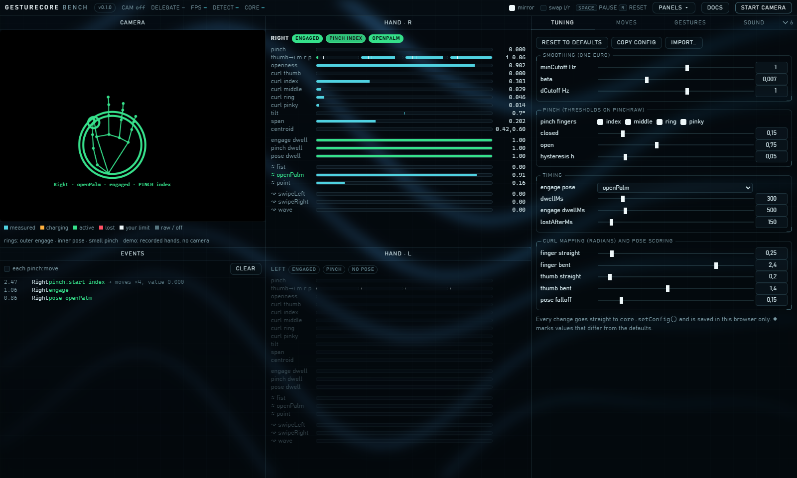
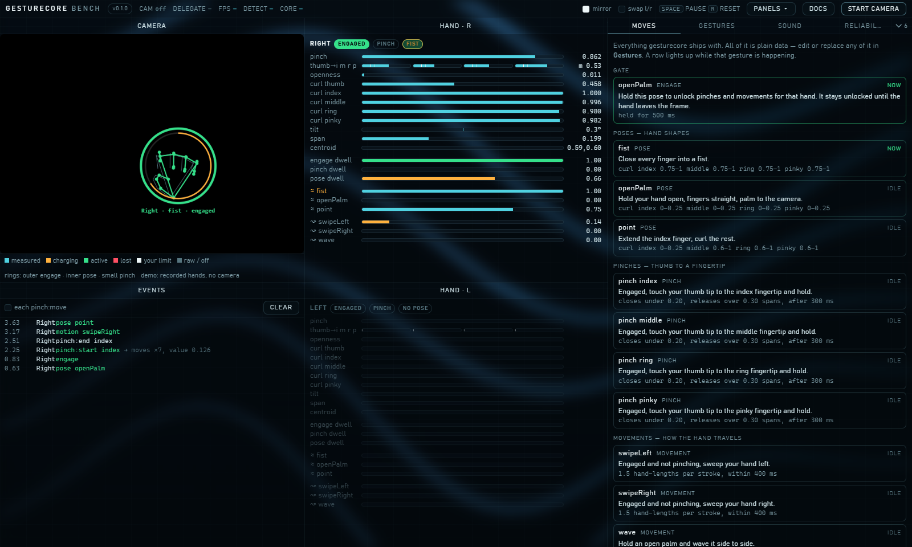
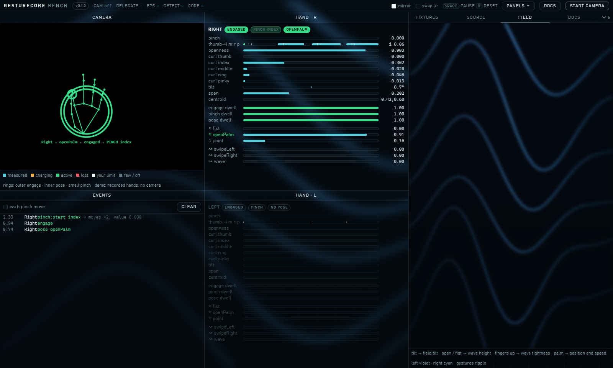
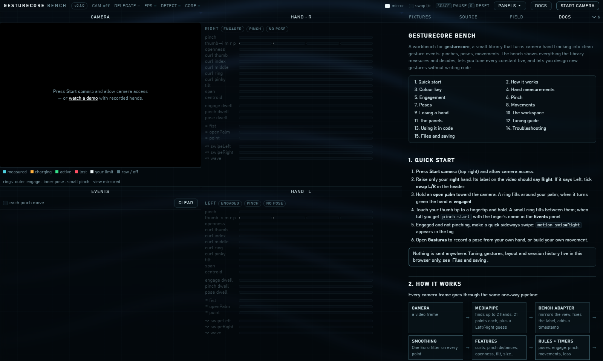

# gesturecore

**Hand-tracking landmarks in, clean gesture events out — plus optional bricks that
build on it.**

**Try it:** [gesturecore.vercel.app](https://gesturecore.vercel.app/bench/) with your camera, or
[the demo](https://gesturecore.vercel.app/bench/?demo) with recorded hands. Nothing leaves your
browser.



This repository is a small family of packages. The core stands alone; every other
package is a *brick*: optional, independent, and something the core never knows about.

| package | what it does | depends on |
| --- | --- | --- |
| [`gesturecore`](packages/core) | pinches, poses and movements from 21 hand landmarks; learning gestures from demonstrations | nothing |
| [`gesturecore-sound`](packages/sound) | synthesized sound cues for gesture events, and hand-controlled voices such as a theremin | `gesturecore` types only |

Planned bricks: visuals that react to hands, and head/eyebrow tracking.

## The core in one screen

```ts
import { GestureCore } from 'gesturecore';

const core = new GestureCore({ aspect: 640 / 480 });
for (const e of core.update(hands, performance.now())) {
  if (e.type === 'pinch:start') console.log(e.hand, 'pinched', e.finger);
}
```

Full documentation: [packages/core](packages/core#readme).

## Adding sound

```ts
import { GestureSound, readerFor } from 'gesturecore-sound';

const sound = new GestureSound();
button.onclick = () => sound.start();          // browsers need a user action first

const events = core.update(hands, t);
sound.update(events, readerFor(core));
```

Full documentation: [packages/sound](packages/sound#readme).

## The bench

A tuning workbench for all of it: live camera, every measurement and timer, a slider
for every constant, gesture recording by demonstration, test captures, and a sound
panel. It is the reference adapter (camera → MediaPipe → core → bricks).

No camera? Add `?demo` to the address and it replays recorded hands through the real
pipeline.

| Every gesture the core knows, lit while it happens | The hand-driven wave field, as its own panel |
| --- | --- |
|  |  |



```bash
npm install
npm run fetch-model     # MediaPipe hand model, 7.8 MB, not in git
npm run bench           # opens http://127.0.0.1:5173/bench/
```

The built-in **Docs** panel explains the whole system.

## Versions

[Semantic Versioning](https://semver.org/), recorded in [CHANGELOG.md](CHANGELOG.md). The
project (bench and site) is tagged `vX.Y.Z`; each package carries its own version. Hover
the bench's version badge to see all three.

## Branches and deployments

- `main` is where development happens. Every push gets its own preview deployment.
- `deploy` is what [gesturecore.vercel.app](https://gesturecore.vercel.app) is built from;
  it moves forward only when a version is released.

The bench's header badge says which one you are looking at: `dev` on your machine,
`preview · <branch>` on a preview, the version number on the published site.

## Develop

```bash
npm test            # every package's tests, Node only
npm run typecheck   # each package, plus the bench
npm run build       # dist/ for every package
```

npm workspaces, no other tooling. The bench and the packages' type checks read each
other's source directly, so nothing needs building while you work.

## AI models

At runtime the packages use none — gestures and sounds are geometry and synthesis. The
bench feeds the core from Google's **MediaPipe Hand Landmarker** (Apache-2.0).

The code, tests and documentation were written with **Claude Opus 5** through Claude
Code, directed, reviewed and hand-tested by [burakTanBilgi](https://github.com/burakTanBilgi);
**Claude Haiku 4.5** was briefly active in one session and wrote none of the code.
Commits carry `Co-Authored-By` trailers naming the model that wrote them.

## Licence

MIT — see [LICENSE](LICENSE).
